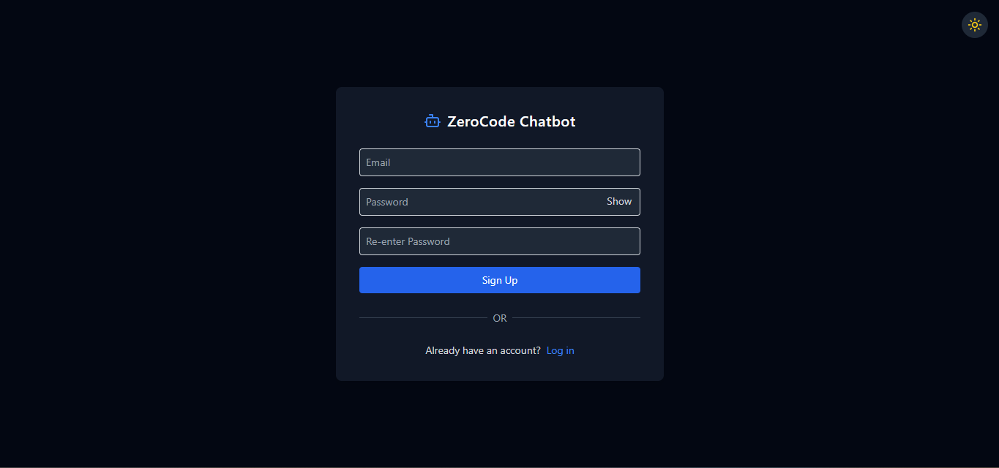
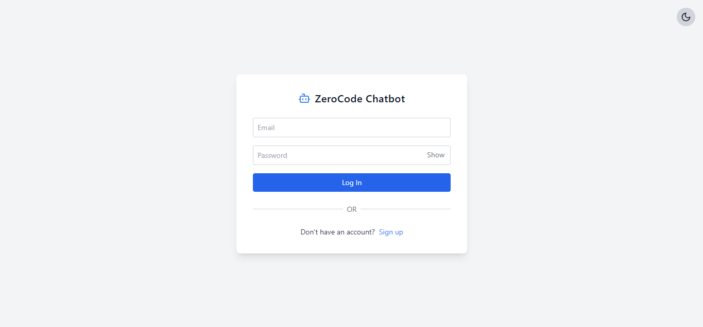
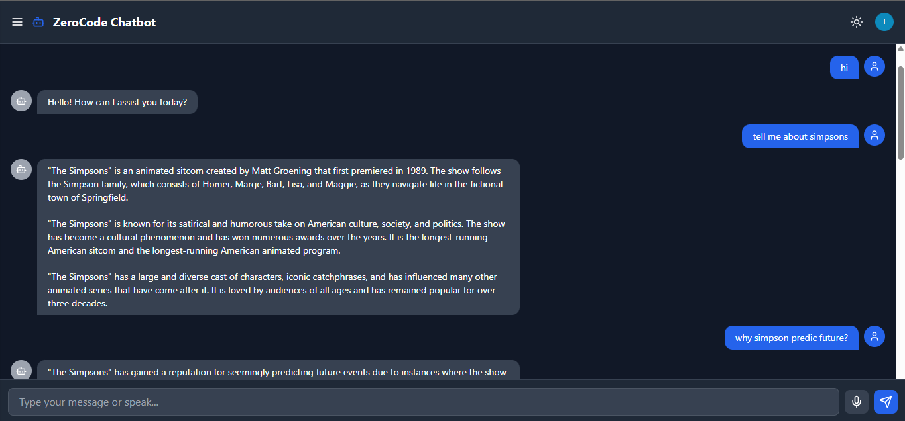
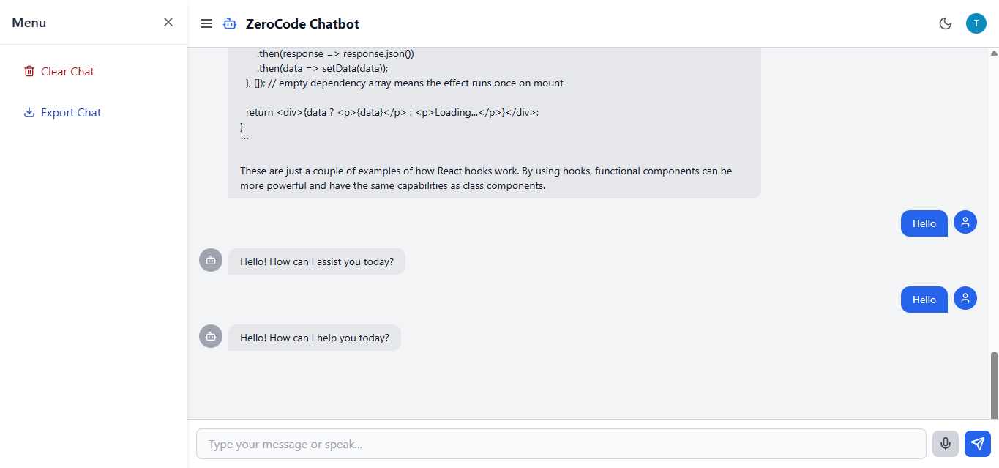
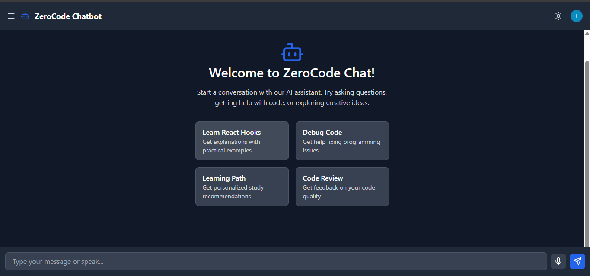

# 🧠 ZeroCode Chatbot

A real-time AI-powered chatbot built with React, Firebase, Firestore, and OpenRouter (ChatGPT API). It supports text and voice inputs (Web Speech API), stores chat history user-wise in Firestore, and offers a responsive UI.

---

## 🚀 Live Demo

[👉 Click here to try ZeroCode Chatbot](https://zerocode-chatbot.netlify.app)

create an account using dummy email "testxxxx@gmail.com" and a password of minimum 6 characters.
---

## 📦 Features

- 🔐 Firebase Authentication (Email/Password)
- 💬 UI with real-time typing
- 🔊 **Voice input support using Web Speech API**  
  > ⚠️ **Works best on Google Chrome**.  
  > May not function on Brave, Safari, or Firefox.
- 📜 Message storage per user in Firestore
- 🌑 Light/Dark mode auto-switch
- 📱 Responsive design across devices
- 🤖 GPT-3.5-turbo via OpenRouter API

---

## 🧱 Tech Stack

- **Frontend:** React, Tailwind CSS, Vite
- **Auth & DB:** Firebase Auth, Firestore
- **AI Backend:** OpenRouter (ChatGPT-compatible API)
- **Voice Input:** Web Speech API

---

## 🛠️ Setup Instructions

### 1. Clone the Repository

git clone https://github.com/suneebs/zerocode-fe-assignment

cd zerocode-fe-assignment

Install Dependencies: 

npm install or npm i

Configure Environment Variables: 

    Create a .env file in the root folder:


        VITE_FIREBASE_API_KEY=your_firebase_api_key
        VITE_FIREBASE_AUTH_DOMAIN=your_project.firebaseapp.com
        VITE_FIREBASE_PROJECT_ID=your_project_id
        VITE_FIREBASE_STORAGE_BUCKET=your_project.appspot.com
        VITE_FIREBASE_MESSAGING_SENDER_ID=your_sender_id
        VITE_FIREBASE_APP_ID=your_app_id

        VITE_OPENROUTER_API_KEY=your_openrouter_api_key

Start the App: 

npm run dev


### 🧠 App Architecture

```
React (Vite)    
│
├── Firebase Authentication  
│   └── Email/password login
│
├── ChatPage.jsx    
│   ├── Message input (text & voice)  
│   ├── Chat bubble rendering  
│   └── History scroll + prompt actions
│
├── Firestore Database  
│   └── /users/{uid}/messages
│
└── OpenRouter API  
    └── GPT-3.5-turbo responses
```


## 🖼️Screenshots & Demo
### 🔐 Signup Page (dark mode)

### 🔐 Login Page (light mode)

### 💬 Chat UI (dark mode)

### 💬 Chat UI with sidebar (light mode)

### 🔮 Prompt templates


### 🎬 Demo  


©️ 2025 Suneeb S
